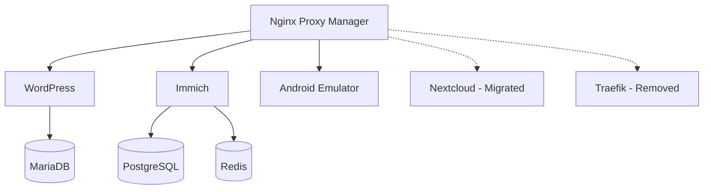

# 🚀 Warp Analysis: Docker Compose Collections

## 📊 Project Overview

**Repository**: Michael-XKCD/docker-compose  
**Purpose**: Production-ready Docker Compose configurations for self-hosted services  
**Architecture**: Microservices with hybrid networking  
**Last Analyzed**: October 2024  

## 🔍 Project Metrics

| Metric | Value |
|--------|-------|
| **Total Files** | 12 |
| **Docker Compose Files** | 5 active services |
| **Total YAML Lines** | 201 |
| **Services Deployed** | 6 containers |
| **Network Complexity** | Hybrid (internal + external) |
| **Largest Component** | Android Emulator (20K) |

## 🏗️ Architecture Analysis

### Service Portfolio



### Network Topology

- **External Networks**: `proxynet`, `br0`
- **Internal Networks**: `backend`, service-specific
- **Security Model**: Internal isolation with proxy egress
- **SSL Strategy**: NPM handles certificate management

## 🛠️ Service Breakdown

### 1. **Nginx Proxy Manager (NPM)** 📡
- **Type**: Reverse Proxy / Load Balancer
- **Deployment**: Dual (Internal + External)
- **Image**: `jc21/nginx-proxy-manager`
- **Purpose**: SSL termination, routing, access control
- **Criticality**: **HIGH** (gateway service)

### 2. **Immich** 📷
- **Type**: Photo/Video Management
- **Architecture**: Multi-container (server + ML + db + cache)
- **Images**: 
  - `ghcr.io/immich-app/immich-server`
  - `ghcr.io/immich-app/immich-machine-learning`
  - PostgreSQL + Redis
- **Features**: AI-powered photo organization, mobile sync
- **Criticality**: **MEDIUM** (personal data)

### 3. **Android Emulator** 📱
- **Type**: Development/Testing Environment
- **Build**: Custom Dockerfile
- **API Level**: 34 (Android 14)
- **Access**: VNC web interface (port 6080)
- **Use Case**: App testing, automation
- **Criticality**: **LOW** (development tool)

### 4. **WordPress** 🌐
- **Type**: Content Management System
- **Domain**: mcmurray.tech
- **Stack**: WordPress + MariaDB
- **Images**: `wordpress` + `mariadb`
- **Purpose**: Personal website/blog
- **Criticality**: **MEDIUM** (public-facing)

### 5. **Nextcloud** ☁️ (Migrated)
- **Status**: **DEPRECATED** → Migrated to AIO
- **Reason**: Official recommendation from Nextcloud team
- **New Deployment**: Nextcloud All-in-One container
- **Migration Path**: Documented in `nextcloud/README.md`

## 📈 Technical Insights

### Strengths 💪
1. **Network Security**: Proper isolation with internal networks
2. **Version Control**: Environment variables for image versions
3. **Reverse Proxy**: Centralized SSL and routing
4. **Documentation**: Comprehensive README and service docs
5. **Maintenance**: Clear backup and update procedures

### Areas for Improvement 🔧
1. **Health Checks**: Missing in most services
2. **Resource Limits**: No CPU/memory constraints
3. **Secrets Management**: Basic .env approach
4. **Monitoring**: No observability stack (Prometheus/Grafana)
5. **Backup Automation**: Manual backup processes

### Security Analysis 🔒
- ✅ Internal network isolation
- ✅ External proxy for SSL termination
- ✅ No direct port exposure to host
- ⚠️ No explicit security scanning
- ⚠️ Default credentials in some services

## 🚀 Deployment Recommendations

### Production Readiness Checklist
- [ ] Add health checks to all services
- [ ] Implement resource limits
- [ ] Set up automated backups
- [ ] Add monitoring stack
- [ ] Security scanning integration
- [ ] Secrets management (Docker Secrets/Vault)
- [ ] Log aggregation

### Infrastructure Scaling
```bash
# Current resource estimates
CPU: ~2-4 cores recommended
RAM: ~4-8GB recommended
Storage: ~100GB+ for media services
Network: Reverse proxy handles routing
```

### Monitoring Strategy
```yaml
# Suggested additions
- Prometheus + Grafana
- Container health endpoints
- Log aggregation (ELK stack)
- Uptime monitoring
- SSL certificate expiry alerts
```

## 🔄 Migration History

| Date | Change | Impact |
|------|--------|---------| 
| Oct 2024 | Removed Traefik | Simplified to NPM-only proxy |
| Oct 2024 | Nextcloud → AIO | Moved to official deployment |
| Oct 2024 | Updated README | Improved documentation |
| Oct 2024 | Added Warp Analysis | Enhanced project insights |

## 🎯 Strategic Direction

### Short Term (1-3 months)
1. Implement health checks
2. Add resource limits
3. Set up automated backups
4. Security audit and hardening

### Medium Term (3-6 months)
1. Add monitoring stack
2. Implement secrets management
3. Container image vulnerability scanning
4. Performance optimization

### Long Term (6+ months)
1. Kubernetes migration evaluation
2. Multi-host deployment
3. Disaster recovery procedures
4. Advanced networking (Mesh)

## 🤖 AI Integration Opportunities

- **Immich**: Already uses ML for photo recognition
- **WordPress**: Content generation plugins
- **Monitoring**: Anomaly detection in metrics
- **Security**: AI-powered threat detection

## 📋 Maintenance Runbook

### Weekly Tasks
- [ ] Check service status: `docker compose ps`
- [ ] Review logs: `docker compose logs --tail=50`
- [ ] Monitor resource usage: `docker stats`

### Monthly Tasks
- [ ] Update images: `docker compose pull && docker compose up -d`
- [ ] Cleanup unused images: `docker image prune`
- [ ] Backup critical volumes
- [ ] SSL certificate status check

### Quarterly Tasks
- [ ] Security audit
- [ ] Performance review
- [ ] Documentation updates
- [ ] Disaster recovery test

---

**Generated by Warp Analysis Engine**  
*This document provides deep insights into the project architecture, recommendations, and strategic direction for continued development and maintenance.*
